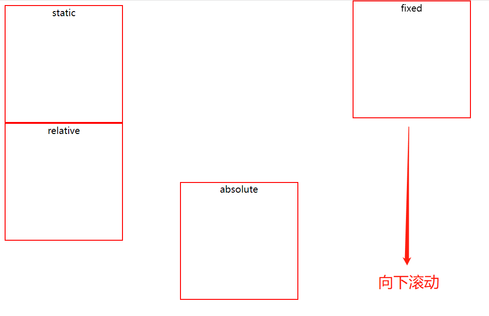

# Lecture 03 HTML & CSS (Part 2)

## 目录

- [3.0 display的类型](#30-display的类型)
    - [3.0.1 常用类型](#301-常用类型)
    - [3.0.2 flex, flexbox, box区别](#302-flex-flexbox-box区别)
- [3.1 Block-level Elements/Inline Elements/Inline-block boxes](#31-block-level-elementsinline-elementsinline-block-boxes)
    - [3.1.1 Block-level Elements](#311-block-level-elements)
    - [3.1.2 Inline Elements](#312-inline-elements)
    - [3.1.3 div & span](#313-div--span)
    - [3.1.4 Inline-block boxes](#314-inline-block-boxes)
- [3.2 Position](#32-position)
    - [3.2.1 static](#321-static)
    - [3.2.2 relative](#322-relative)
    - [3.2.3 absolute（重点）](#323-absolute重点)
    - [3.2.4 fixed](#324-fixed)
    - [3.2.5 sticky](#325-sticky)
- [3.3 Units](#33-units)
    - [3.3.1 Absolute units](#331-absolute-units)
    - [3.3.2 Relative units](#332-relative-units)
    - [3.3.3 BEM（Block Element Modifier）](#333-bemblock-element-modifier)

# 课堂笔记

### 3.0 display的类型：


#### 3.0.1 常用类型：
- block
- inline
- inline-block
- flex

#### 3.0.2 flex, flexbox, box区别：
- 名字的由来：
    - W3C制定标准 2009年第1次草案：[display:box;]
    - W3C制定标准 2011年第2次草案：[display:flexbox | inline-flexbox;]
    - W3C制定标准 2012年第5次草案及以后的候选推荐标准：[display:flex | inline-flex;]
- 所以，无太大差别，旧版本（box）、混合版本（flexbox）、新版本（flex）。


### 3.1 Block-level Elements/Inline Elements/Inline-block boxes

#### 3.1.1 Block-level Elements

- 特性：
    - 占据parent element的所有宽度。
    - 在竖直方向上，从上往下叠加。
    - 适用于Box Model。宽度、高度可变。  
    


- Default Elements：
    - div, body, main, header, footer, section, nav, aside, h1-h6, p, ul, ol, li, etc.（Inline好记，记住inline，其他都是block）

- With CSS:
    ```css
    {
    display: block;
    }
    ```

- Example:
    

#### 3.1.2 Inline Elements

- 特性：
    - 并不是占用整行，只占用内容所需要的宽度。
    - Box Model不完全适用：宽和高不能设置。
    - padding和margin只是水平适用。

- Default Elements：
    - span, a, img, strong, em, button, etc.

- With CSS:
    ```css
    {
    display: inline;
    }
    ```

- Example:
    

#### 3.1.3 div & span

- div (division) 
    - div属于block-level element.
    - div拥有block-level elements的特性：占据整行，宽度是整个父级的宽度。

- span
    - span属于inline element
    - span拥有inline element的特性：并不是每个span都占据整行，只根据内容占据相应宽度。

- Practice 1：正常情况下的div和span

```html
<html>
<head>
    <title>Block Inline Elements</title>
    <link rel="stylesheet" type="text/css" href="/block-inline-elements.css">
</head>
<body>
    <div class="box block">Block element 1</div>
    <div class="box block">Block element 2</div>
    <div class="box block">Block element 3</div>
    <!-- 这里的box和block用空格隔开，是两个class -->
    <hr>  <!-- 换行 -->
    <span class="box inline">Inline element 1</span>
    <span class="box inline">Inline element 2</span>
    <span class="box inline">Inline element 3</span>
</body>
</html>
```

```css
.box {
    border: 2px solid red;
}
.block {
    width: 300px;
    display: block;
}
hr {
    margin: 20px 0;
}
.inline {
    display: inline;
}
```

>结果


- Practice 2：如果css中block的display变成inline，即

```css
.block {
    width: 300px;
    display: inline;
}
```

>结果：


- Practice 3：如果css中inline的display变成block，即

```css
.inline {
    display: block;
}
```

>结果：


- Practice 4：如果css中block加上padding和margin，即

```css
.block {
    width: 300px;
    display: block;
    padding: 10px;
    margin: 10px;
}
```

>结果：


- Practice 5：如果css中inline加上margin和padding，即

```css
.inline {
    display: inline;
    margin: 10px;
    padding: 10px;
}
```

>结果：


#### 3.1.4 Inline-block boxes

- 特性：
    - boxes外部遵循inline element原则，boxes内部遵循block element原则。

- Practice 1：查看css中inline-block的margin和padding，即

```html
    <span class="box inline-block">Inline block element 1</span>
    <span class="box inline-block">Inline block element 2</span>
    <span class="box inline-block">Inline block element 3</span>
```

```css
.inline-block {
    display: inline-block;
    padding: 10px;
    margin: 10px;
}
```

>结果：


### 3.2 Position
- position类型：  


- 常用类型：
    - static
    - relative
    - absolute
    - fixed
    - sticky

#### 3.2.1 static

```html
<!DOCTYPE html>
<html lang="en">
<head>
    <title>Positioning</title>
    <link rel="stylesheet" type="text/css" href="/positioning.css">
</head>
<body>
    <div class="box static">static</div>
</body>
</html>
```

```css
.box {
    border: 2px solid red;
    width: 200px;
    height: 200px;
    text-align: center;
}

top: 0; /* -y */
bottom: 0; /* y */
left: 0; /* -x*/
right: 0; /* x */
/* 一般上下不同时出现，左右不同时出现 */

.static {
    position: static;
    left: 100px;
    top: 100px;
}
```

>结果：

左边和上面都给了100px，但是不会有任何变化。因为position是static。

#### 3.2.2 relative

- 给出上下左右的值，应该怎样移动？

```html
    <div class="box relative">relative</div>
```

```css
.relative {
    position: relative;/* 它相对的是哪个物体？ */
    bottom: 100px;
    top: 100px; /* 往下移了100px */
    right: 100px;
    left: 100px;
}
```

>结果：

上下左右都给了100px的值，而且下和右在前面设置的，最后结果还是显示的向下和向左，所有是上左优先。

#### 3.2.3 absolute（重点）

- 参照物：符合两个条件的父级（缺一不可）：  
    - nearest
    - positioned

- 对比：把absolute放在body下和relative下的区别

    - 放在body下：
    ```html
    <body>
        <div class="box static">static</div>
        <div class="box relative">relative</div>
        <div class="box absolute">absolute</div>
    </body> 
    ```

    ```css
    .absolute {
    position: absolute;
    top: 100px;
    }   
    ```

    >结果：
    
    这时参照的是body的边缘，也就是距最上面的边缘100px。

    - 放在relative下：
    ```html
    <body>
        <div class="box static">static</div>
        <div class="box relative">relative
            <div class="box absolute">absolute</div>
        </div>
    </body>
    ```

    ```css
    .absolute {
    position: absolute;
    top: 100px;
    }   /* css不变 */
    ```

    >结果：
    
    这时参照的是relative的边缘，也就是距relative上面的边缘100px。  
    之所以relative能作为参照物，是因为同时满足：1.nearest；2.positioned. 又是父级。

#### 3.2.4 fixed

- 参照物：viewport，我们能看到的、浏览器用来展示当前内容的窗口。
- viewport：当浏览器向下滚动时，viewport没有变，内容变了。

```html
    <div class="box fixed">fixed</div>
```

```css
.fixed {
    position: fixed;
    top: 0;
    left: 40%;
}
```

>结果：
  
fixed随着页面向下滚动而滚动，但是在viewport中的位置保持不变。

#### 3.2.5 sticky

- 当到达某一临界值时，被固定在一个地方。

```html
    <div class="box sticky">sticky</div>
```

```css
.sticky {
    position:sticky;
    top: 150px;
    left: 0;
}
```

>结果：
 
 
图1时没碰到relative的时候，图2是碰到relative之后，随着relative往下走了。  
sticky介于relative和fixed之间，或者说是二者共同体。

### 3.3 Units

#### 3.3.1 Absolute units
    - cm, mm, in, px(*), pt, pc

#### 3.3.2 Relative units
    - em: (current font)是从父类那里继承过来的。如果实在找不到父类，那就查computing。
     
    - rem：针对计算机setting来说的。
    - vw：view width
    - vh：view height

```html
<!DOCTYPE html>
<html lang="en">
<head>
    <title>Units</title>
    <link rel="stylesheet" type="text/css" href="/units.css">
</head>
<body>
    <div class="box fifty-percent">50%</div>
    <div class="box one-hundred-px">100px</div>
    <div class="box fifty-vw">50vw</div>
    <hr>
    <div class="parent-container">
        <div class="box fifty-percent">50%</div>
        <div class="box one-hundred-px">100px</div>
        <div class="box fifty-vw">50vw</div>
    </div>
</body>
</html>
```

```css
.box {
    border: 2px solid black;
    background-color: red;
}
div {
    margin-bottom: 8px;
}
hr {
    margin: 20px 0;
}
.fifty-percent {
    width: 50%;
}
.one-hundred-px {
    width: 100px;
}
.fifty-vw {
    width: 50vw;
}
```

>结果：
   
1）50% of body  
2）100px固定  
3）50% of viewport
viewport > body, 所以3) > 1)

#### 3.3.3 BEM（Block Element Modifier）
- 用来命名css的class name
